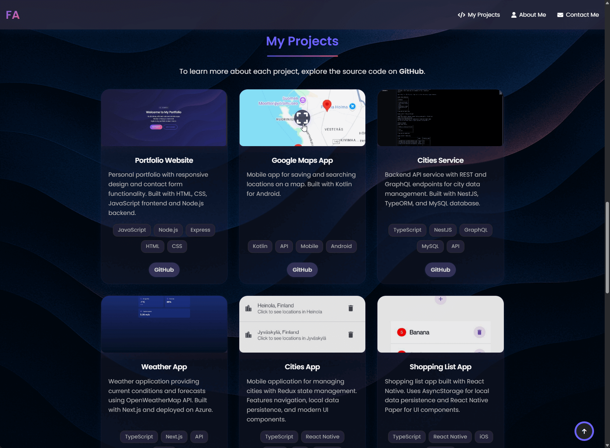

# 🚀 My Portfolio Website

A modern, responsive portfolio website to showcase my skills and projects. Built with best practices in design and development, this site is optimized for both desktop and mobile users.

- **Visitors:**  
  Browse projects, read about my skills, and use the contact form to get in touch.

- **Visit my website here:**
[ferhatdev.com](https://www.ferhatdev.com/)

---

## 🌟 Features

- **Responsive Design:** Seamless experience across devices
- **Parallax Background:** Background that is visually engaging
- **Project Gallery:** Interactive showcase with images
- **Contact Form:** Secure, with backend integration
- **Smooth Animations:** Enhanced user experience
- **Accessibility:** Easy to navigate

---

## 🛠️ Technologies Used

- **Frontend:** HTML5, CSS3, JavaScript (ES6)
- **Backend:** Node.js, Express.js
- **Database:** MongoDB
- **Email:** Nodemailer
- **UI:** Font Awesome, Google Fonts

---

## 🎬 Demo Video

**Click the image above to watch a demo video on Vimeo.**

---

## 🖼️ Screenshots  

### 📱 Mobile View  

---

### 💻 Desktop View  

   

---

> Thank you for visiting my portfolio!  
> Feel free to connect, collaborate, or provide feedback.
